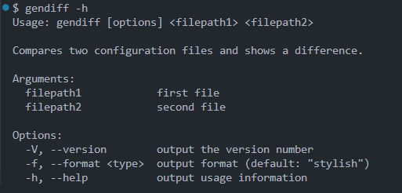
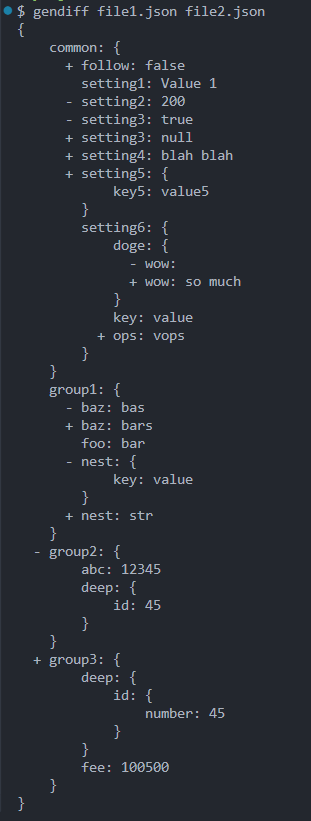
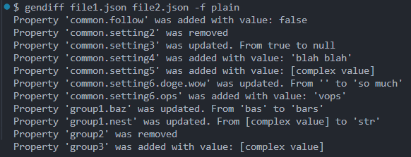
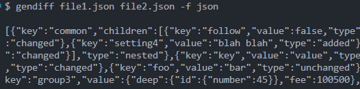

### Hexlet tests and linter status:

---

### Проект №2

# Вычислитель отличий

Вычислитель отличий – программа, определяющая разницу между двумя структурами данных. Это популярная задача, для решения которой существует множество онлайн сервисов, например http://www.jsondiff.com/. Подобный механизм используется при выводе тестов или при автоматическом отслеживании изменений в конфигурационных файлах.

#### Возможности утилиты:

- Поддержка разных входных форматов: **yaml**, **json**
- Генерация отчета в виде **plain** **text**, **stylish** и **json**

#### Примеры работы

- Помощь по программе

  

    

    
 Сравнение stylish 

  

    

    
    

    
 Сравнение plain 

  

    

    
    

        
 Сравнение json 

    

    

